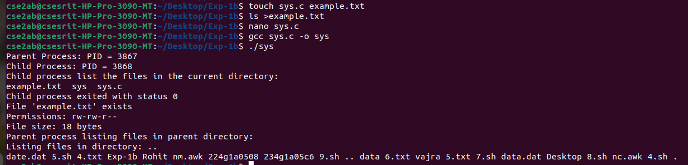

# Program Statement:
To implement UNIX operating system calls fork, exec, getpid, exit, wait, close, stat, opendir and
readdir
# Program Description
Description of `fork`, `exec`, `getpid`, `exit`, `wait`, `close`, `stat`, `opendir`, and `readdir` System
Calls

- **`fork()`**: Creates a new process by duplicating the current process, returning `0` to the child
and the child’s PID to the parent.
- **`exec()`**: Replaces the current process image with a new program. Does not return on success.
- **`getpid()`**: Retrieves the unique process ID of the calling process.
- **`exit()`**: Terminates a process and releases its resources, returning a status code to the parent.
- **`wait()`**: Suspends the calling process until a child process terminates, allowing retrieval of the
child&#39;s exit status.
- **`close()`**: Closes an open file descriptor to free associated resources.
- **`stat()`**: Retrieves file or directory metadata, including size, permissions, and timestamps.
- **`opendir()`**: Opens a directory stream for reading its entries.
- **`readdir()`**: Reads individual entries from a directory stream, returning their details.

These system calls are essential for process management, file handling, and directory navigation in
UNIX-like operating systems.
# Source Code:

```c
#include &lt;stdio.h&gt;
#include &lt;stdlib.h&gt;
#include &lt;sys/types.h&gt;
#include &lt;sys/wait.h&gt;
#include &lt;sys/stat.h&gt;
#include &lt;unistd.h&gt;
#include &lt;dirent.h&gt;
#include &lt;fcntl.h&gt;

void print_permissions(mode_t mode) {
char perms[10];

// User permissions
perms[0] = (mode &amp; S_IRUSR) ? &#39;r&#39; : &#39;-&#39;;
perms[1] = (mode &amp; S_IWUSR) ? &#39;w&#39; : &#39;-&#39;;
perms[2] = (mode &amp; S_IXUSR) ? &#39;x&#39; : &#39;-&#39;;

// Group permissions
perms[3] = (mode &amp; S_IRGRP) ? &#39;r&#39; : &#39;-&#39;;
perms[4] = (mode &amp; S_IWGRP) ? &#39;w&#39; : &#39;-&#39;;
perms[5] = (mode &amp; S_IXGRP) ? &#39;x&#39; : &#39;-&#39;;

// Other permissions
perms[6] = (mode &amp; S_IROTH) ? &#39;r&#39; : &#39;-&#39;;
perms[7] = (mode &amp; S_IWOTH) ? &#39;w&#39; : &#39;-&#39;;
perms[8] = (mode &amp; S_IXOTH) ? &#39;x&#39; : &#39;-&#39;;

perms[9] = &#39;\0&#39;; // Null-terminate the string

printf(&quot;Permissions: %s\n&quot;, perms);

}

void list_directory(const char *path) {
DIR *dir = opendir(path);
struct dirent *entry;

if (dir == NULL) {
perror(&quot;opendir&quot;);
return;
}

printf(&quot;Listing files in directory: %s\n&quot;, path);
while ((entry = readdir(dir)) != NULL) {
printf(&quot;%s &quot;, entry-&gt;d_name);
}
printf(&quot;\n&quot;);

closedir(dir);
}

int main() {
pid_t pid;
int status;
struct stat file_info;

// Using fork to create a new child process
pid = fork();
if (pid &lt; 0) {
perror(&quot;fork failed&quot;);
exit(1);
}

if (pid == 0) { // Child process
printf(&quot;Child Process: PID = %d\n&quot;, getpid());
printf(&quot;Child process list the files in the current directory:\n&quot;);
// Using exec to replace the process image
execlp(&quot;/bin/ls&quot;, &quot;ls&quot;, NULL); // List files in the current directory
perror(&quot;exec failed&quot;); // If exec fails
exit(1);
} else { // Parent process
printf(&quot;Parent Process: PID = %d\n&quot;, getpid());

// Wait for the child process to finish
wait(&amp;status);
if (WIFEXITED(status)) {
printf(&quot;Child process exited with status %d\n&quot;, WEXITSTATUS(status));
}

// Using stat to get information about a file
if (stat(&quot;example.txt&quot;, &amp;file_info) == 0) {
printf(&quot;File &#39;example.txt&#39; exists\n&quot;);
print_permissions(file_info.st_mode); // Print human-readable permissions
printf(&quot;File size: %ld bytes\n&quot;, file_info.st_size);
} else {
perror(&quot;stat failed&quot;);
}

// Using opendir and readdir to list files in a directory
printf(&quot;Parent process listing files in parent directory:\n&quot;);
list_directory(&quot;..&quot;);

// Demonstrating file operations with open, write, and close

int fd = open(&quot;testfile.txt&quot;, O_WRONLY | O_CREAT, 0644);
if (fd == -1) {
perror(&quot;open failed&quot;);
exit(1);
}

write(fd, &quot;Hello, this is a test file!\n&quot;, 26);
close(fd); // Closing the file

// Exit the parent process
exit(0);
}
}
```
# Interpretation of the program

This C program demonstrates the use of several important system calls in a Unix-based operating
system. Below is a step-by-step breakdown of the program&#39;s actions:

## 1. Creating a Child Process (`fork()`)
- The program starts by creating a **child process** using `fork()`.
- **`fork()`** splits the program into two processes: the **parent process** and the **child
process**.

## 2. Child Process
- In the **child process**, the program uses `execlp()` to replace the current process with a new
program (`/bin/ls`), which lists the files in the current directory.
- The child process **executes the `ls` command** and shows the contents of the directory.

## 3. Parent Process
- The **parent process** waits for the child process to finish using `wait()`.
- Once the child finishes, the parent continues its work.

## 4. Getting File Information (`stat()`)
- The parent process uses the **`stat()`** function to get information about a file called
`example.txt`.
- It then prints the **permissions** (like `rwxr-xr--`) and **file size** of `example.txt`.

## 5. Listing Directory Content (`opendir()` and `readdir()`)
- The parent process then lists the files in the **parent directory** (i.e., `..`) using `opendir()` and
`readdir()`.
- These functions open a directory and read its contents, printing the names of the files inside.

## 6. File Operations (Create, Write, Close)
- The parent process **creates a new file** called `testfile.txt` using the **`open()`** system call. If
the file doesn&#39;t exist, it is created.
- It **writes** a message into the file using the **`write()`** system call.
- Finally, it **closes** the file using `close()`.

## 7. Program Ends
- After completing all tasks, the parent process exits.

## Summary:
- The program demonstrates how to:
- Create processes with `fork()`.
- Execute commands using `execlp()`.
- Fetch file information using `stat()`.
- List files in directories with `opendir()` and `readdir()`.
- Perform basic file operations like creating, writing, and closing files.

In short, the program shows how to interact with files and directories in a Unix-like system using
system calls.
# HOW to execute Program
&gt; Open the terminal

&gt;
&gt; create a file example.txt
&gt;
&gt; `touch example.txt`
&gt;
&gt; `ls &gt; example.txt`
&gt;
&gt; compile the program
&gt;
&gt; `gcc filename.c -o exec-name`
&gt;
&gt; run the program
&gt;
&gt; `./exec-name`
&gt;
# Output of the code

